# Powdery Mildew Detection In Cherry Leaves
Predictive Analytics project as a part of the Diploma in Full Stack Software Development from the Code Institute:
This application stands out as an innovative tool designed to evaluate the health of cherry leaves by detecting the presence of powdery mildew. By processing an image of a cherry leaf, the Powdery Mildew Detector is adept at distinguishing between a healthy leaf and one that's compromised.

At the heart of this application lies a supervised binary classification machine learning model. This binary classifier is pivotal in making accurate predictions regarding the leaf's health status.

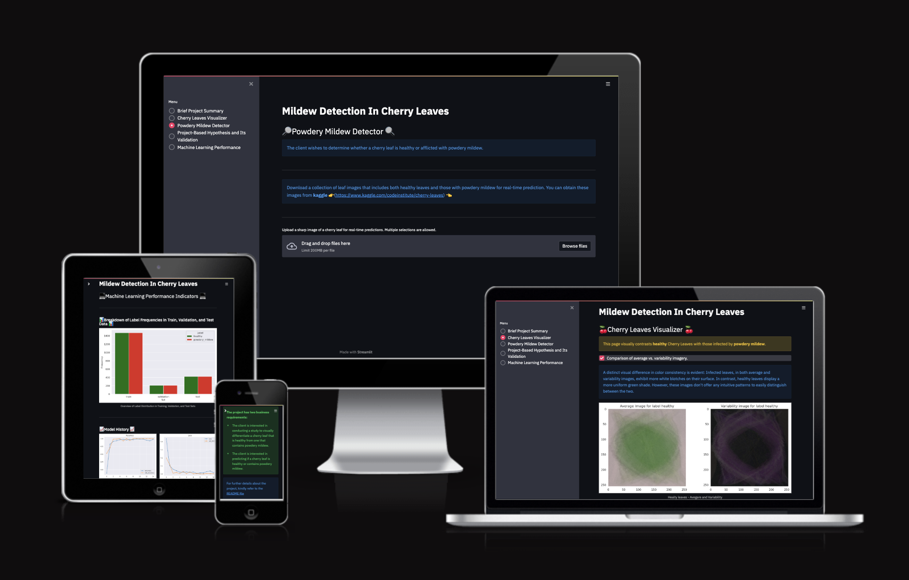

## Dataset Content
* The dataset is sourced from [Kaggle](https://www.kaggle.com/codeinstitute/cherry-leaves). We then created a fictitious user story where predictive analytics can be applied in a real project in the workplace.
* The dataset contains +4 thousand images taken from the client's crop fields. The images show healthy cherry leaves and cherry leaves that have powdery mildew, a fungal disease that affects many plant species. The cherry plantation crop is one of the finest products in their portfolio, and the company is concerned about supplying the market with a compromised quality product.

## Business Requirements
The cherry plantation crop from Farmy & Foods is facing a challenge where their cherry plantations have been presenting powdery mildew. Currently, the process is manual verification if a given cherry tree contains powdery mildew. An employee spends around 30 minutes in each tree, taking a few samples of tree leaves and verifying visually if the leaf tree is healthy or has powdery mildew. If there is powdery mildew, the employee applies a specific compound to kill the fungus. The time spent applying this compound is 1 minute.  The company has thousands of cherry trees, located on multiple farms across the country. As a result, this manual process is not scalable due to the time spent in the manual process inspection.

To save time in this process, the IT team suggested an ML system that detects instantly, using a leaf tree image, if it is healthy or has powdery mildew. A similar manual process is in place for other crops for detecting pests, and if this initiative is successful, there is a realistic chance to replicate this project for all other crops. The dataset is a collection of cherry leaf images provided by Farmy & Foods, taken from their crops.

* 1 - The client is interested in conducting a study to visually differentiate a healthy cherry leaf from one with powdery mildew.
* 2 - The client is interested in predicting if a cherry leaf is healthy or contains powdery mildew.

## Hypothesis and how to validate?
Leaves compromised by powdery mildew manifest distinct attributes that set them apart from their healthy counterparts. Common signs of an infected leaf encompass specific markings and noticeable morphological alterations. For instance, such leaves might appear lighter in shade and have an almost-circular shape. Another less obvious characteristic is the emergence of powdery patches, especially on younger and more vulnerable leaves.

A visual compilation, or Image Montage, can pinpoint a typical leaf affected by powdery mildew, chiefly by identifying the subtle white marks present. Conversely, analyses using Average Image, Variability Image, and the Difference between Averages failed to present a definitive pattern for leaf differentiation.

The machine learning model is engineered to discern between a healthy and a mildew-infected cherry leaf with a precision of at least 97%.

## The rationale to map the business requirements to the Data Visualisations and ML tasks

### Business Requirements

* 1 - Visually differentiate a cherry leaf that is healthy from one that contains powdery mildew.
* 2 - Predict if a cherry leaf is healthy or contains powdery mildew using a machine learning model.

### Mapping to Data Visualizations

#### Visual Differentiation
* Image Montage: Using the "Cherry Leaves Visualizer" page, a visual compilation of healthy and infected leaves is provided, serving as a direct visual guide to the prominent characteristics of each type.
* Average vs. Variability Imagery: This comparison in the Streamlit app offers insights into the visual difference in color consistency between healthy and infected leaves. Infected leaves exhibit more white blotches on their surface, while healthy leaves display a uniform green shade.
* Difference in Average Imagery: This visualization helps identify discrepancies in the appearance of healthy leaves versus infected ones.
* Histograms and Distribution Plots: Not explicitly in the Streamlit app, but can be considered for a future enhancement. By plotting histograms for healthy vs. infected leaves, users can visually identify unique patterns or trends that differentiate the two categories.

### Mapping to ML Tasks

#### Prediction
* Real-time Prediction: The "Powdery Mildew Detector" page provides a real-time prediction feature. Users can upload a cherry leaf image, and the system will return its prediction (healthy or infected). This is a direct application of the binary classification ML model.
* Model Performance Metrics: The "Machine Learning Performance Indicators" page offers insights into the ML model's performance, including model training accuracy, losses, and generalized outcomes.
* Model Validation: Ensuring the model's robustness by measuring its performance on validation and test data sets.
* Performance Metrics: Displayed metrics, such as loss and accuracy, are crucial given the potential commercial implications of misclassification.

### Additional Insights
Given the severity of powdery mildew's impact, there's also a potential to expand on the economic implications of the disease. Visualizations showing potential revenue loss due to undetected infections could be a compelling addition for stakeholders.

To summarize, the Streamlit application offers a comprehensive suite of tools to both visually understand and predict the presence of powdery mildew in cherry leaves. By mapping these functionalities to the business requirements, the solution not only provides theoretical understanding but also actionable insights and tools for practical application in the cherry farming and distribution industry.

## ML Business Case
* Using the provided image dataset, our goal is to develop a supervised, single-label, binary classification ML model to determine whether a cherry leaf has powdery mildew.
* Currently, this disease is detected manually, requiring approximately 30 minutes inspection per tree. This method is not only time-intensive but also lacks scalability.
* This model aims to offer a quicker and more dependable app for determining if a leaf exhibits powdery spots, indicating the cherry plants are unwell.
* The model's result is presented as a flag, signaling whether the leaf exhibits any signs of infection. Plantation staff will photograph various tree leaves and upload them to the app, where an instantaneous prediction will be generated.
* The training data, comprising 4208 images, is available on Kaggle.
* We aim for a success rate of 97% accuracy or higher on the test set.
* This initiative will enhance the quality of the company's produce.

## Dashboard Design

### Wireframes:

### Finished Project

Project dashboard features a side navigation bar that directs to five distinct pages. 
Here are the details of those pages:

#### Brief Project Summary

#### Cherry Leaves Visualizer

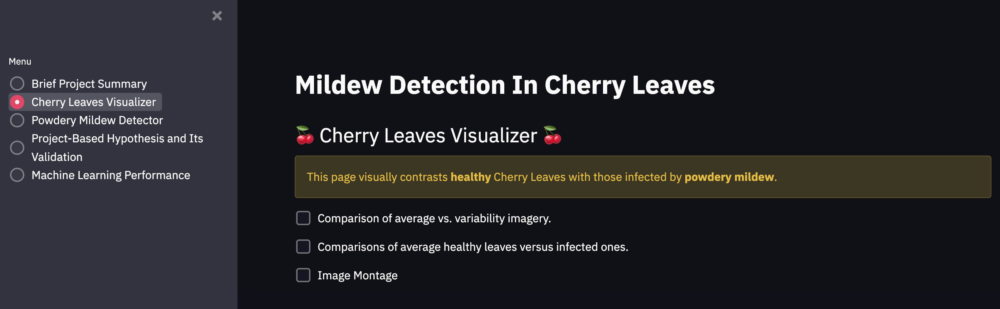

* Comparison of average vs. variability imagery.
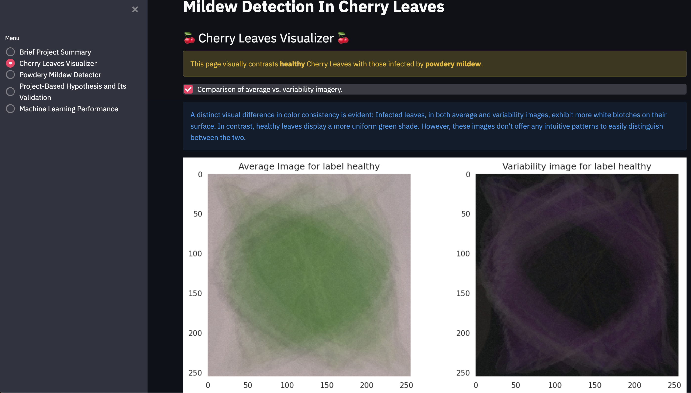
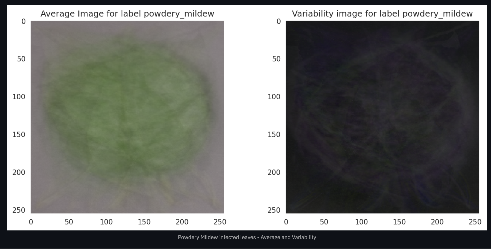
* Comparisons of average healthy leaves versus infected ones.
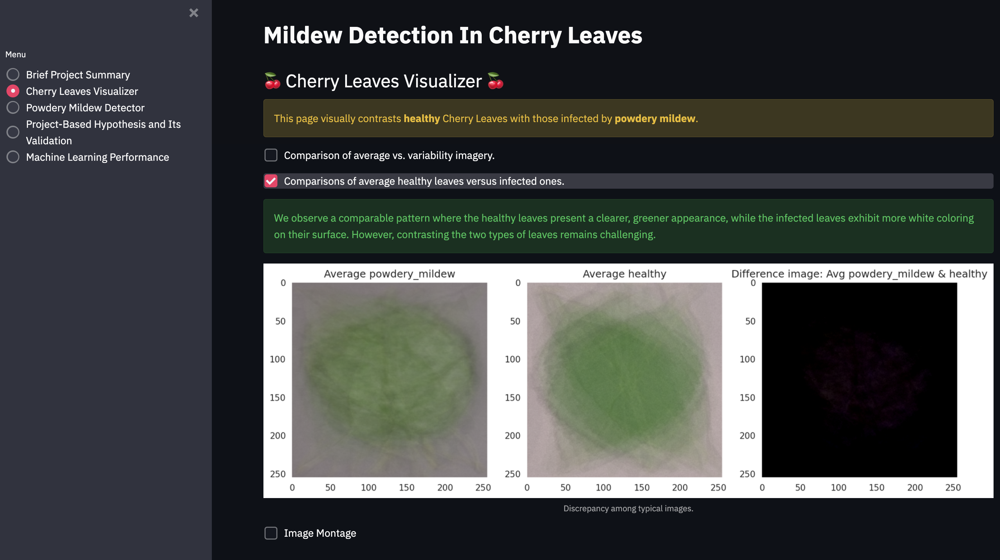
* Image Montage
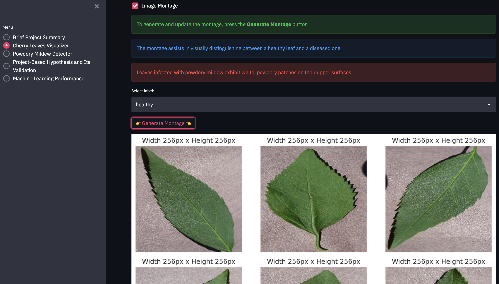

#### Powdery Mildew Detector

* Download link for a collection of images depicting healthy and unhealthy leaves for real-time prediction.
* A user interface featuring a file upload tool. Users are prompted to upload images of leaves. Upon upload, the image will be displayed along with a prediction message, specifying whether the leaf is healthy or unhealthy.
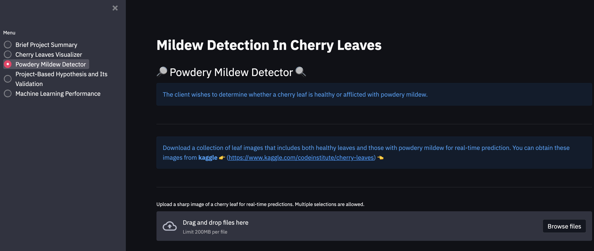
* A table detailing the image name and the corresponding prediction outcome.
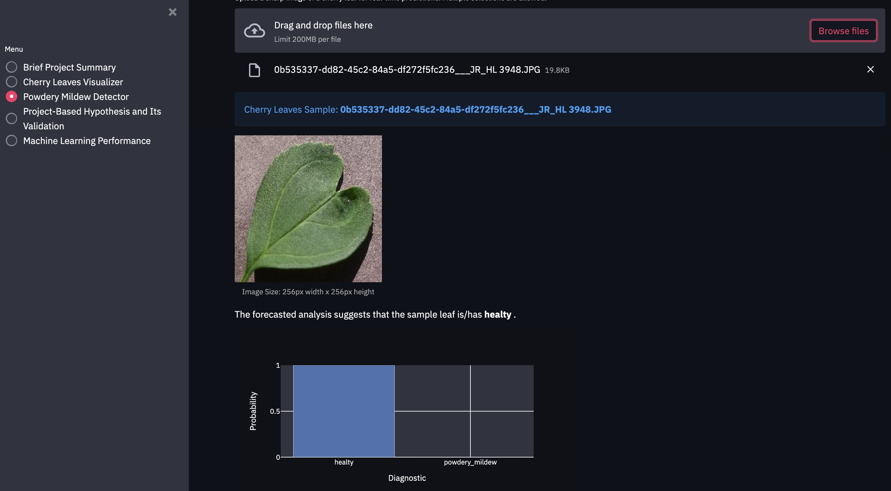
* A button to download the prediction outcome.
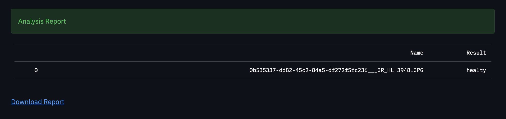

#### Project-Based Hypothesis and Its Validation

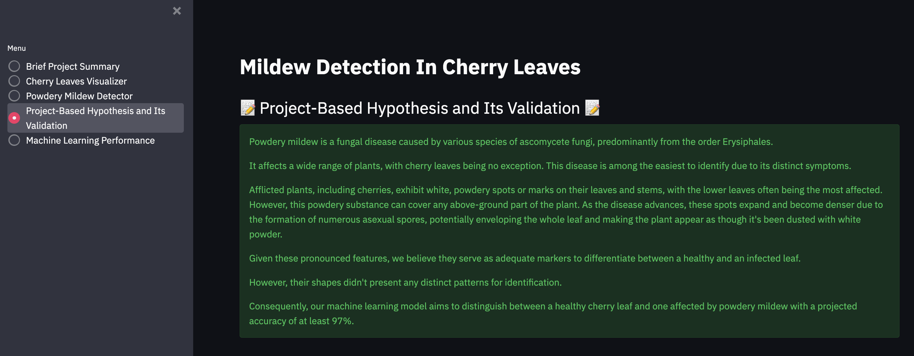

#### Machine Learning Performance

* Label Frequencies for Train, Validation and Test Sets

* Model Training Accuracy and Losses
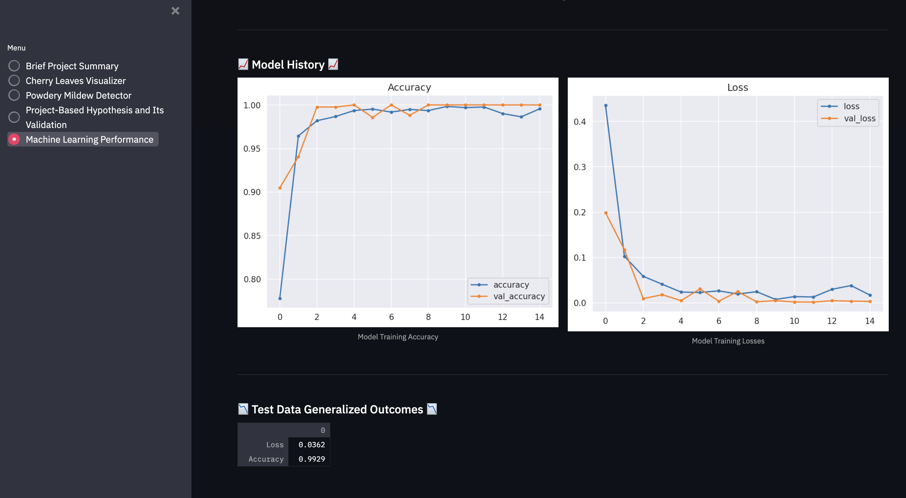
Our ML prediction accuracy is 99,29%.

## Deployment

### Heroku

* The App live link is: https://ml-mildew-detection-pp5-e969717a4d76.herokuapp.com/
* Set the runtime.txt Python version to a [Heroku-20](https://devcenter.heroku.com/articles/python-support#supported-runtimes) stack currently supported version.
* The project was deployed to Heroku using the following steps.

1. Log in to Heroku and create an App
2. At the Deploy tab, select GitHub as the deployment method.
3. Select your repository name and click Search. Once it is found, click Connect.
4. Select the branch you want to deploy, then click Deploy Branch.
5. The deployment process should happen smoothly if all deployment files are fully functional. Click now the button Open App on the top of the page to access your App.
6. If the slug size is too large then add large files not required for the app to the .slugignore file.

## Main Data Analysis and Machine Learning Libraries

### Languages

* Python

### Frameworks and associated technologies

* Git: Git served as the version control tool, with commits being made through the Gitpod terminal and subsequently pushed to GitHub,
* GitHub: This platform was employed to house the project's code after it was transferred from Git,
* Balsamiq: This tool was utilized for crafting wireframes,
* Heroku: This container-centric cloud service was used for deploying the project,

### Libraries for Data Analysis and Machine Learning

* Numpy: An open-source Python library designed for array operations. It boasts extensive mathematical functions, random number capabilities, and linear algebra routines,
* Matplotlib: A cross-platform Python library for visualizing data and creating graphical plots,
* Seaborn: A Python-based data visualization library built on Matplotlib, primarily used for visualizing random distributions,
* Pandas: An open-source Python package tailored for handling datasets. It provides tools for data analysis, cleaning, exploration, and manipulation,
* Plotly: An interactive, open-source graphing library for browsers, especially useful for creating visual presentations within Jupyter notebooks,
* Streamlit: A tool designed for creating web applications tailored to data science and machine learning tasks,
* Tensorflow: An open-source platform specializing in deep neural networks for machine learning,
* Shutil: A utility module for file copying and deletion,
* Joblib: Offers a collection of tools for creating lightweight pipelines in Python,
* PIL: Stands for Python Imaging Library, which is a free, open-source library enhancing Python's capabilities in opening, editing, and saving a variety of image file formats,

## Credits

* [Wikipedia](https://en.wikipedia.org/wiki/Powdery_mildew#Tree_leaves) for informations about powdery mildew,
* [Streamlit emoji shortcodes](https://streamlit-emoji-shortcodes-streamlit-app-gwckff.streamlit.ap) for emoji used in the app,
* [Cherry Powdery Mildew](https://ca.decisionaid.systems/articles/cherry_powdery_mildew) for more information about powdery mildew,
* [Streamlit](https://docs.streamlit.io/library/api-reference/status) for information about Streamlit,
* CI Slack for trubleshooting,
* Project on Malaria Analysis from Code Institute: The original code and design were sourced from [CI WalkthroughProject01](https://github.com/Code-Institute-Org/WalkthroughProject01). I adjusted the code provided to suit my app. This project enhanced my comprehension of Machine Learning and Data Analytics, reaffirming my confidence in choosing the right specialization for myself.

